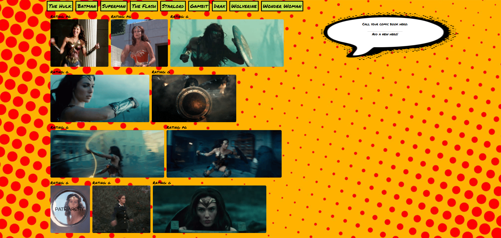

# GifGenerator
Created a Gif Generator with a Superhero theme. This application allows users to input new characters and creates new character buttons. When a user selects a button, 10 gifs are generated. The still and animated states of the gifs can be toggled on and off by clicking on the gif.

**Technology used:** AJAX, jQuery, JavaScript, HTML, and CSS.

Below is a screenshot of the application:
